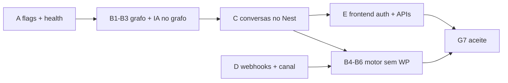

# Botify G7 — Checklist: zero dependência do WordPress (padrão Omni backend)

Objetivo: **WordPress fora do caminho crítico** — domínio, runtime, auth e UI no padrão **NestJS + Prisma + Postgres + JWT/`UserTenant`**, conforme [ADR-0002](../adr/ADR-0002-botify-wordpress-to-backend-cutover.md) fase **G7**.

**Já existe no repo (não repetir):** G0 contrato `shared-types`, G1 `BotifyBot`/`BotifyFlow`, G2 CRUD/publish/import/simulate, G3 motor Nest (parcial), G4 `BOTIFY_FLOW_SOURCE` + runtime interno, G5 `VITE_BOTIFY_DATA_SOURCE` + `botify-domain-api` (só bots/fluxos), G6 import WP→Omni.

**Esta lista cobre o que falta para “100% backend”** e a ordem sugerida para codar depois de validarmos juntos.

---

## Definição de pronto (G7)

| Critério | Verificação |
|----------|-------------|
| Grafos | Criar/editar/publicar fluxos **só** via `/botify/*` (Vite com `VITE_BOTIFY_DATA_SOURCE=omniconnect`). |
| Runtime | Microserviço com `BOTIFY_FLOW_SOURCE=omniconnect` processa mensagens **sem** `WordPressClient` no hot path. |
| Conversas | Resolver conversa, listar/gravar mensagens e enviar WhatsApp **sem** rotas `wp-json/botflow/*`. |
| Auth | Login Botify via **JWT Omni**; sem `wpApi.login` / tokens WP no browser. |
| Config canal | Meta/Evolution/contas **tenant-scoped no Omni** (ou delegado ao core de canais), não só no plugin PHP. |
| Deploy | Perfil `omniconnect-only`: `WORDPRESS_*` opcionais ou ausentes; health não falha por WP down. |
| WP | Plugin PHP pode permanecer para **import legado** até desligar; não é dependência de produção. |

Comando rápido de auditoria (deve tender a **zero** no hot path após G7):

```bash
# Microserviço — imports do client WP
rg "WordPressClient|wordpress-client" apps/botify/wordpress-plugin/botflow-manager/microservice/src

# Vite — uso directo de WP (além de fallback explícito em dual)
rg "wpApi|wordpress-api" apps/botify/src --glob '!**/botify-domain-api.ts'
```

---

## Bloco A — Config e flags (já parcialmente feito)

| # | Item | Estado | Notas |
|---|------|--------|--------|
| A1 | `BOTIFY_INTERNAL_SYNC_SECRET` + `OMNICONNECT_BOTIFY_TENANT_ID` alinhados backend ↔ microserviço | ✅ local | Fase 1/2 ops |
| A2 | `BOTIFY_FLOW_SOURCE=omniconnect` em staging/piloto | ⬜ | Hoje default `wordpress` |
| A3 | `VITE_BOTIFY_DATA_SOURCE=omniconnect` no Vite | ⬜ | Editor de grafos |
| A4 | `WORDPRESS_*` opcionais em `microservice/src/config.ts` quando `BOTIFY_FLOW_SOURCE=omniconnect` | ✅ | Zod condicional wordpress/dual |
| A5 | Health microserviço: WP não obrigatório em modo `omniconnect` | ✅ | `routes/health.ts` — WP `skipped` + `/ready` Omni |

**Aceite A:** subir microserviço só com Omni vars; `GET /health` 200 sem WP acessível.

---

## Bloco B — Grafo e motor (runtime microserviço)

| # | Item | Ficheiros / API | Depende de |
|---|------|-----------------|------------|
| B1 | Carregar grafo **só** via `omniconnect-flow-runtime.ts` (já existe) | `services/omniconnect-flow-runtime.ts` | A2, secret |
| B2 | Remover `getFlowConfig` WP do caminho quando `omniconnect` | `flow-engine.ts`, `message-queue.ts` | B1 |
| B3 | Config de nó IA a partir do **grafo publicado** (JSON no fluxo) ou endpoint Nest | `flow-engine.ts`, `ai-processor.ts`; hoje `getAINodeConfig` → WP | G2 + contrato `BotifyAiNodePersistedConfig` |
| B4 | Histórico IA: `listConversationMessages` → **Omni** (Conversation/Message por tenant+phone ou conversationId) | Novo client ou extensão internal API | Bloco C |
| B5 | `saveMessage` / `sendWhatsAppMessage` → Omni ou **ChannelConnection** existente no core | `wordpress-client.ts` métodos finais | Bloco C, D |
| B6 | `resolveConversation` → criar/obter conversa no core (tenant-scoped) | WP `microservice/conversation/resolve` | Bloco C |
| B7 | Logs webhook/IA para WP (`logMetaWebhook`, `logAIProcessing`, …) → structured logs ou tabela audit Omni | `webhook-handler.ts`, `ai-processor.ts` | opcional pós-MVP |
| B8 | Testes Vitest: motor com `BOTIFY_FLOW_SOURCE=omniconnect` mock fetch runtime | `*.spec.ts` | B1–B3 |

**Aceite B:** um fluxo publicado no Nest é executado de ponta a ponta (simulate ou webhook de teste) sem chamada HTTP ao WP.

---

## Bloco C — Domínio conversas/mensagens no `omniconnect-backend`

Hoje o Nest Botify cobre **bots/fluxos**; conversas WhatsApp do Botify ainda vivem no plugin.

| # | Item | Estado | Notas |
|---|------|--------|--------|
| C1 | `BotifyConversation` + `BotifyMessage` + migration `20260524120000_sprint_6_botify_conversations` | ✅ | Distinto de `Conversation` do inbox operacional |
| C2 | `POST /botify/conversations/resolve` | ✅ | JWT + internal |
| C3 | `GET /botify/conversations`, `GET .../messages` | ✅ | Paginação |
| C4 | `POST /botify/conversations/:id/messages` | ✅ | Roles `user` \| `assistant` \| `system` |
| C5 | `POST .../send` + `PATCH /botify/bots/:id/channel` | ✅ | Meta Cloud via `BotifyBot.channelConfig` + `WhatsappCloudService` |
| C6 | Internal: `botify/internal/conversations/*` | ✅ | `BotifyInternalGuard` |
| C7 | Testes isolamento tenant | ✅ | `botify-conversations.service.spec.ts` |
| C8 | Microserviço usa Omni em vez de WP | ✅ | `omniconnect-conversations.ts` + `conversation-store.ts` + `flow-engine` |

**Aceite C (parcial):** API Nest pronta; falta ligar microserviço e envio WhatsApp real.

---

## Bloco D — Canal WhatsApp / Meta / Evolution

| # | Item | Hoje | Alvo |
|---|------|------|------|
| D1 | Webhook Meta/Evolution entra no microserviço | ✅ | `META_APP_SECRET` + verify token env; logs estruturados |
| D2 | Lookup `botId`/`flowId` por conta ou instância | ✅ | `channelConfig` + `GET /botify/internal/routing/*` |
| D3 | Config WhatsApp por bot | ✅ | `PATCH /botify/bots/:id/channel` + token encriptado |
| D4 | Contas Meta / Evolution | ✅ | `BotifyMetaAccount` + Chips Omni + Settings (`metaAccountId`) — ver [botify-inbound-channels-flow.md](./botify-inbound-channels-flow.md) |
| D5 | Webhook logs operacionais | 🟡 | Logger no microserviço; WP só em modo dual/wordpress |

**Aceite D:** nova instalação piloto não instala PHP para receber WhatsApp.

---

## Bloco E — Frontend Vite (`apps/botify`)

| # | Item | Ficheiros | Notas |
|---|------|-----------|--------|
| E1 | Auth: login/refresh via Omni (`/auth/login`, cookie refresh) | ✅ | `src/lib/omniconnectClient.ts` + `AuthContext` + `VITE_BOTIFY_AUTH_SOURCE` |
| E2 | Remover dependência de `wpApi` para sessão | 🟡 | Omni default; WP se `VITE_BOTIFY_AUTH_SOURCE=wordpress` |
| E3 | `botify-domain-api`: conversas, mensagens, channel → Omni | ✅ | `omniconnect-botify-api` + `botify-domain-api` |
| E4 | Páginas: `Messages`, `Settings`, `Health` sem `wpApi` directo | ✅ | Health usa `/api/health` + `/api/microservice/health` |
| E5 | AI config no editor: gravar no grafo ou `PATCH /botify/flows/:id` | `FlowEditor.tsx`, hooks | alinhado B3 |
| E6 | `VITE_BOTIFY_DATA_SOURCE=omniconnect` em `.env` piloto | `.env.example` | |
| E7 | Documentar token Omni no Vite (nunca `BOTIFY_INTERNAL_SYNC_SECRET` no browser) | README + phase docs | segurança |

**Aceite E:** build Vite; operador edita fluxo e vê conversas sem URL WP no Network tab.

---

## Bloco F — Backend Nest (extensões além de G2)

| # | Item | Endpoint / serviço |
|---|------|------------------|
| F1 | Persistir configs IA no `draftGraph` / `publishedGraph` (se ainda não uniforme) | `botify.service` update flow |
| F2 | `GET /botify/health` ou extensão `GET /health` com bots/flows count por tenant | ops |
| F3 | Import WP one-shot documentado; flag “legacy import only” | `POST /botify/import/wordpress` ✅ |
| F4 | Handoff `transfer` pode disparar bridge **do Nest** (opcional) além do microserviço | `BotifyFlowEngineService` + bridge existente |
| F5 | Rate limit + audit em rotas internal | guards |

---

## Bloco G — WordPress / ops / docs

| # | Item |
|---|------|
| G1 | Runbook: perfil “só Omni” vs “dual” vs “legado WP” |
| G2 | `DEPLOYMENT-COOLIFY.md` / README: WP opcional |
| G3 | Descontinuar instalação plugin para **clientes novos** (comunicação produto) |
| G4 | Manter `POST /botify/import/wordpress` até migração de clientes legados |
| G5 | Atualizar `sprint-6-botify-maturity-plan.md`: G7 = esta checklist |
| G6 | Piloto `pilot-flow-lead-to-recovery.md`: passo Botify sem WP |

---

## Ordem sugerida para codar (após validação)



1. **A4–A5** — config/health sem WP obrigatório (rápido, desbloqueia dev).  
2. **B3** — IA config no grafo publicado (desacopla `getAINodeConfig` WP).  
3. **C1–C6** — API conversas/mensagens (maior bloco; desbloqueia motor e UI).  
4. **B4–B6** — microserviço usa C via internal ou JWT de serviço.  
5. **E1–E4** — auth + UI no Omni.  
6. **D1–D4** — webhooks e canal sem PHP.  
7. **G** — docs e piloto.

---

## Matriz: quem consome o quê hoje

| Capacidade | WordPress | Omni Nest | Microserviço |
|------------|-----------|-----------|--------------|
| CRUD bots/fluxos (UI) | ✅ default | ✅ flag Vite | — |
| Grafo runtime | ✅ `getFlowConfig` | ✅ internal runtime | lê um ou outro |
| Auth UI | ✅ JWT plugin | ⬜ | — |
| Conversas/mensagens | ✅ REST plugin | ⬜ | ✅ via WP client |
| Envio WhatsApp | ✅ `microservice/send` | ⬜ (core parcial) | via WP |
| Handoff Omni | — | ✅ webhook | ✅ `omniconnect-bridge` |
| Meta/Evolution webhooks | plugin + log WP | ⬜ | ✅ entrada |
| Import legado | fonte | ✅ destino | — |

---

## Ver também

- [ADR-0002](../adr/ADR-0002-botify-wordpress-to-backend-cutover.md)
- [botify-phase1-operational-setup.md](./botify-phase1-operational-setup.md)
- [botify-phase2-operational-validation.md](./botify-phase2-operational-validation.md)
- [sprint-6-botify-maturity-plan.md](./sprint-6-botify-maturity-plan.md)
- [ADR-0001](../adr/ADR-0001-botify-tenancy-model.md) — tenancy handoff
- `apps/botify/wordpress-plugin/botflow-manager/microservice/src/services/wordpress-client.ts` — inventário métodos WP

---

## Próximo passo (validação contigo)

Antes de codar, confirmar prioridade:

1. **Caminho mínimo piloto:** A4–A5 + B1–B3 + `VITE_BOTIFY_DATA_SOURCE=omniconnect` (grafos só Omni; conversas ainda WP temporariamente)?  
2. **Caminho G7 completo:** Bloco C antes de desligar WP no motor?  
3. **Auth Omni no browser** (E1) em paralelo ou depois de C?

Responde 1 / 2 / 3 (ou combinação) e começamos pelo primeiro PR pequeno da ordem acima.
