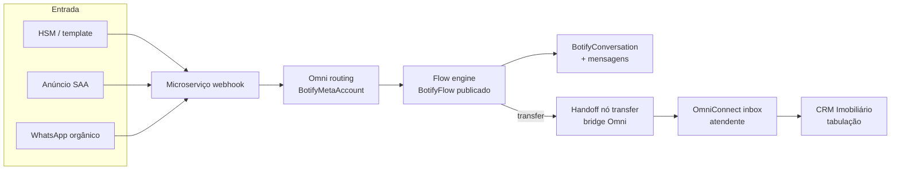

# Botify — Fluxos de entrada (HSM, SAA, orgânico)

Fonte única de canal: **`BotifyMetaAccount`** (tenant-scoped) + vínculo **`BotifyBot.metaAccountId`**.

## Três origens, um pipeline

| Origem | Como o cliente chega | Primeiro toque |
|--------|----------------------|----------------|
| Campanha HSM | Disparo template → cliente responde | Webhook Meta → microserviço → fluxo Botify |
| Anúncio (SAA) | Click-to-WhatsApp / formulário → mensagem | Idem |
| Orgânico | Indicação, busca, número salvo | Idem |



## Configuração (Chips + Settings)

1. **Chips** — criar conta Meta (`POST /botify/meta-accounts`), token encriptado, sync WABA/`metaWabaAccountId` e `phoneNumberIds`.
2. **Settings** — bot → selecionar **Conta Meta** (`metaAccountId`) + `phoneNumberId` + **fluxo publicado** (`defaultFlowId`).
3. **Microserviço** — `META_APP_SECRET`, webhook em `{MICROSERVICE}/webhooks/meta`.

Routing: `GET /botify/internal/routing/meta/:accountId` consulta `BotifyMetaAccount` antes do JSON legado em `channelConfig`.

## Handoff para humano + CRM

- Nó **`transfer`** no grafo → bridge `botify.handoff.created` (ver `pilot-flow-lead-to-recovery.md` §3.4).
- Atendente no **OmniConnect** assume a conversa operacional.
- Tabulação / estágio comercial → **CRM** via integrações existentes do tenant.

## APIs Chips Omni

| Método | Path |
|--------|------|
| GET | `/botify/meta-accounts` |
| GET | `/botify/meta-accounts/active` |
| GET | `/botify/meta-accounts/:id/credentials` |
| POST | `/botify/meta-accounts` |
| PATCH | `/botify/meta-accounts/:id` |
| POST | `/botify/meta-accounts/:id/activate` |
| DELETE | `/botify/meta-accounts/:id` |

Migração one-shot: contas em `localStorage` (`meta_accounts`) são importadas na primeira carga do Chips se o tenant ainda não tiver contas no Omni.

## Validação automatizada

```bash
./scripts/botify-pilot-validation.sh
```

Ver também [`botify-phase2-operational-validation.md`](./botify-phase2-operational-validation.md).
