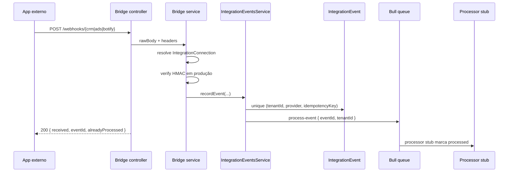

# Sprint 4 — Bridge Processors Reais

Status: Blocos 1–6 fechados (processors + emitters + api-client + smoke + ops).

## Objetivo

Transformar webhooks de integrações em ações de negócio dentro do
`omniconnect-backend`: eventos recebidos por CRM/SAA/Botify deixam de ser
apenas persistidos e enfileirados e passam a criar/atualizar leads,
contatos, campanhas, handoffs e sinais de atribuição.

## Bloco 1 — Discovery dos Bridges Atuais ✅

### Fluxo Atual

### Módulos Existentes

| Provider | Módulo | Endpoint | Queue | Processor |
|---|---|---|---|---|
| CRM | `apps/omniconnect-backend/src/crm-bridge/` | `POST /webhooks/crm` | `crm-events` | `CrmEventProcessor` |
| Ads | `apps/omniconnect-backend/src/ads-bridge/` | `POST /webhooks/ads` | `ads-events` | `AdsEventProcessor` |
| Botify | `apps/omniconnect-backend/src/bot-bridge/` | `POST /webhooks/botify` | `bot-events` | `BotEventProcessor` |

Todos usam o mesmo padrão:

- `x-integration-id` resolve `IntegrationConnection`.
- `x-signature` valida HMAC-SHA256 do raw body em produção.
- `idempotency-key` é usado quando enviado; senão usa `sha256(rawBody)`.
- `IntegrationEvent` persiste payload, assinatura, provider e status.
- Bull recebe job `process-event` com `{ eventId, tenantId }`.

### Models Relevantes

`IntegrationConnection`

- `tenantId`
- `provider` (`crm`, `ads`, `bot`, e também `clicksign` em assinatura)
- `webhookSecretEncrypted`
- `status`

`IntegrationEvent`

- `tenantId`
- `connectionId`
- `provider`
- `idempotencyKey`
- `payload`
- `status` (`received`, `processed`, `failed`)
- `errorMessage`
- unique composto: `(tenantId, provider, idempotencyKey)`

### Gaps Encontrados

| Gap | Impacto |
|---|---|
| Processors só chamam `markProcessed` | Eventos não viram `CrmLead`, contato, campanha ou handoff. |
| Payloads são schemaless | Difícil garantir contrato entre apps e backend. |
| Sem API de CRUD para `IntegrationConnection` | Conexões precisam seed/manual/migration. |
| Bridges não emitem `SystemEvent` | Auditoria operacional fica só em `IntegrationEvent`. |
| Sem rate limiting específico nos webhooks bridge | Superfície pública depende só de HMAC/idempotência. |
| External apps ainda não têm client emissor | CRM/SAA/Botify não publicam eventos padronizados. |
| Docs antigas citam rotas diferentes | Código usa `/webhooks/crm`, `/webhooks/ads`, `/webhooks/botify`. |

## Bloco 2 — Processor Base Multi-Tenant ✅

Entrega:

1. Contrato mínimo em `bridge-event-contract.ts`:
   - `eventType`
   - `occurredAt`
   - `externalId`
   - `source`
   - `data`
2. Processors carregam `IntegrationEvent` por `{ id, tenantId, provider }`.
3. Payload é validado por provider/eventType antes de qualquer handler.
4. Dispatcher base aceita:
   - `crm.lead.created`
   - `crm.lead.updated`
   - `ads.lead.created`
   - `botify.handoff.created`
5. `markProcessed` e `markFailed` agora atualizam por `{ id, tenantId }`.
6. Dispatcher registra `SystemEvent` resumido, sem payload bruto/PII.

Critério de pronto validado:

- Job com event cross-tenant não carrega row de outro tenant.
- Payload inválido falha no dispatcher e o processor marca `failed`.
- Payload válido ainda é no-op de domínio, mas passa pelo dispatcher.
- Specs provam idempotência, tenant scope e validação do contrato.

## Bloco 3 — Handlers de Domínio ✅

Entrega:

1. `crm.lead.created` cria ou atualiza `CrmLead` tenant-scoped.
2. `crm.lead.updated` atualiza apenas campos comerciais permitidos
   (`source`, `stage`, `propertyInterest`, `estimatedValue`) para evitar
   sobrescrever PII/manual (`name`, `email`, `phone`, `notes`).
3. `ads.lead.created` cria ou atualiza `CrmLead` com origem de campanha.
4. `botify.handoff.created` faz `upsert` de `Contact` tenant-scoped e cria
   `MessageQueue` pendente para atendimento humano.
5. `SystemEvent` continua resumido: event id, provider, eventType,
   externalId e source, sem payload bruto.

Decisão técnica do Bloco 3:

- Como `CrmLead` ainda não tem colunas `externalProvider`/`externalId`, o
  dedupe de domínio usa marcador técnico em `notes`:
  `[bridge:{provider}:{externalId}]`.
- A idempotência forte continua sendo o unique composto de
  `IntegrationEvent` (`tenantId`, `provider`, `idempotencyKey`).
- Esta decisão foi substituída no Bloco 4 por `IntegrationEntityLink`.

Critério de pronto validado:

- Eventos CRM/Ads criam lead com `tenantId` do `IntegrationEvent`.
- Evento CRM update busca pelo marcador dentro do mesmo tenant.
- Evento Botify cria contato e fila dentro do tenant correto.
- Specs garantem que PII do payload não entra no `SystemEvent`.

## Bloco 4 — External ID Mapping + Hardening de Webhook ✅

Entrega:

1. Nova tabela tenant-scoped `IntegrationEntityLink`:
   - `tenantId`
   - `provider`
   - `externalId`
   - `entityType`
   - `entityId`
   - unique composto `(tenantId, provider, externalId, entityType)`.
2. Dedupe dos handlers migrou de `notes` para `IntegrationEntityLink`.
3. `botify.handoff.created` também usa mapping para não duplicar
   `MessageQueue` quando o mesmo `externalId` chega com idempotency key
   diferente.
4. Rate limiting específico para `/webhooks/crm`, `/webhooks/ads`
   e `/webhooks/botify` usando o módulo interno de rate limiting.
5. Specs ampliadas para mapping explícito e limite por chave
   `bridge:{provider}:{integrationId}`.

Critério de pronto validado:

- `crm.lead.created` cria `CrmLead` e `IntegrationEntityLink`.
- `crm.lead.updated` resolve o lead pelo mapping tenant-scoped.
- `botify.handoff.created` não duplica fila para o mesmo external id.
- Webhooks CRM/Ads/Botify chamam `RateLimitingService`.
- Backend `tsc` limpo; specs de bridge/rate-limit verdes.

Observação operacional:

- A migration versionada é
  `20260520210000_sprint_4_integration_entity_links`.
- Após aplicar a migration em ambiente real, rodar `prisma generate` no app
  backend para expor o delegate gerado de `IntegrationEntityLink`.

## Bloco 5 — Client Emissor nos Apps Satélite ✅

Entrega:

1. **Backend — emissor autenticado**: `POST /integrations/bridge/events`
   (JWT) valida `IntegrationConnection` do **mesmo tenant** do usuário e
   chama `IntegrationEventsService.recordEvent` — sem expor segredo HMAC
   nos browsers do CRM/SAA.
2. **CRM** (`crm-imobiliario`): `src/lib/bridgeEmit.ts` + chamadas após
   `createLead` / `updateLead` em `src/lib/api/crm.ts`. Env opcional:
   `VITE_OMNICONNECT_BRIDGE_CONNECTION_ID` (conexão `provider=crm`).
3. **SAA** (`smart-ad-automator`): `src/lib/bridgeEmit.ts` + emissão após
   análise IA bem-sucedida em `AIAnalysisPanel`. Env opcional:
   `VITE_OMNICONNECT_ADS_BRIDGE_CONNECTION_ID` (conexão `provider=ads`).
4. **Botify** (microserviço Node): `src/services/omniconnect-bridge.ts`
   assina HMAC e posta em `/webhooks/botify`; nó de fluxo `action` +
   `actionType === 'transfer'` dispara o handoff. Envs:
   `OMNICONNECT_API_URL`, `OMNICONNECT_BOT_BRIDGE_CONNECTION_ID`,
   `OMNICONNECT_BOT_BRIDGE_WEBHOOK_SECRET`.
5. Spec backend: `integration-bridge-emit.service.spec.ts`.

Observação de segurança:

- CRM e SAA **não** armazenam o segredo do webhook no bundle; apenas o
  **id da conexão** (público no sentido de UUID) e o JWT do utilizador.

## Bloco 6 — Consolidar API client / docs operacionais ✅

Entrega:

1. **`packages/api-client`** (`@omniconnect/api-client`): `postBridgeEvent`, tipos do corpo
   alinhados ao `EmitBridgeEventDto`, constante `INTEGRATIONS_BRIDGE_EVENTS_PATH`.
2. **CRM e SAA**: `src/lib/bridgeEmit.ts` passa a usar `@omniconnect/api-client` (sem mudar
   contrato de env).
3. **Smoke backend**: `src/test/bridge-emit-crm-lead-smoke.spec.ts` — emissor autenticado
   → job CRM síncrono (mock de fila) → dispatcher → `CrmLead` + `IntegrationEntityLink`.
4. **Operação**: `docs/operations/integration-connections.md` — criação/rotação de
   conexões, script `scripts/encrypt-bridge-webhook-secret.ts` no backend.

## Pós-Sprint 4

- **Próximo foco planejado:** Sprint 5 — InsightAI v2 (`docs/migration/sprint-5-insight-ai-v2.md`):
  providers Anthropic/Gemini, dashboard com filtros, custo agregado por tenant.
- **Backlog opcional (não bloqueia Sprint 5):** CRUD admin para
  `IntegrationConnection` (hoje: seed / SQL / script operacional).
